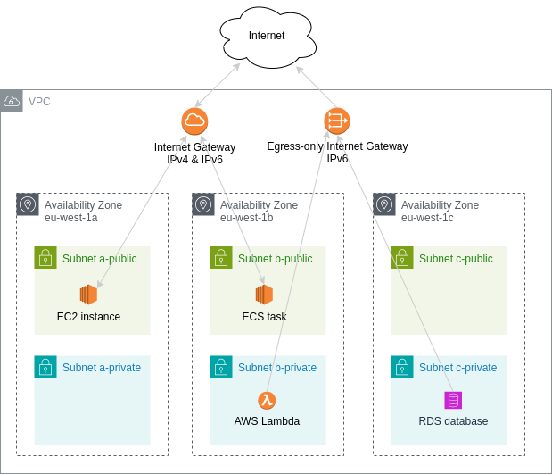

# Pulumi AWS Toolbox

The Pulumi AWS Toolbox is an opinionated library containing components to build the infrastructure for website projects.

It's mostly useful for projects that follow these design ideas:
* being as serverless as possible, with pay per request AWS resources while avoiding resources that incur a fixed cost per hour
* websites that are mostly static using S3 and CloudFront
* backends implemented with AWS Lambda

Install with

    npm i @smartstream-tv/pulumi-aws-toolbox

## Components

### Vpc
The Vpc component is a core component that provides networking functionality. It's needed to run things like EC2 instances, ECS tasks, RDS databases, and AWS Lambda functions. It's an opionionated component focused on the use of IPv6 instead of IPv4 (no NAT gateways provided). It doesn't try to support everything and doesn't provide many configuration options.

Architecture:



It sets up subnets for three availability zones (= data centers). This allows to build applications with very high availability.

Resources in a public subnet can be reached and can communicate to the internet via IPv4 and IPv6.
 * For IPv4, resources need to have a public IPv4 address.
 * AWS Lambda does not support public IPv4 address, you would need NAT gateways for this, which we don't want to use do their cost.

Resources in a private subnet can communicate to the internet only via IPv6 and cannot be reached from the internet at all.
* By default, you should place resources that don't need to be reached from the internet here. 

Components:
* [Jumphost](src/vpc/Jumphost.ts): Creates a jumphost EC2 instance.
* [StdSecurityGroup](src/vpc/StdSecurityGroup.ts): A simple security group for many standard cases.
* [Vpc](src/vpc/Vpc.ts): the VPC component itself.

### Lambda
Components:
* [SimpleNodeLambda](src/lambda/SimpleNodeLambda.ts): Creates a Nodejs AWS Lambda with useful defaults for small & simple tasks.

### SES
Components:
* [SesProxyMailer](src/ses/SesProxyMailer.ts): Creates a AWS Lambda to send email using SES using IPv6 and/or from another account.

### Website

#### Static website
The [StaticWebsite](src/website/StaticWebsite.ts) component creates a CloudFront distribution and a number of supporting resources to create a mostly static website. It's an opinionated component that tries to solve the common cases of website hosting - but it may not be suitable for all cases.

The following things happen under the hood:
- By default assets are loaded from S3.
- HTTPS handled by CloudFront, using a free HTTPS certificate from AWS.
- DNS records are created in Route53.
- Automatically handles URL rewrites, so that when the user loads example.com/product, it will internally load product/index.html from S3.
- Efficient caching. The cache-control response header is set automatically to force the browser to re-validate resources before it can use them. If you have assets that never change, configure them with "immutablePaths".
- HTTP basic auth can be enabled to protect the website, e.g. for dev.
- Access logs are stored in S3.
- Additonal resources can be integrated (see "integrations" argument) e.g.
  - a backend can be integrate underneath /api
  - environment specific configuration could be added at /config.json
- Automatically sets common HTTP security headers for responses.

Primarily, assets are loaded from S3 (specified by an S3Artifact). The bucket must be provided by you, for example, using the S3ArtifactStore component. The bucket must be provided by you, to care for cases where
the bucket should be shared by several dev stacks and must therefore already exist during the CI build phase or additional settings/permissions should be configured for the bucket (like cross-account access from prod).

Example:
```typescript
import * as pat from "@smartstream-tv/pulumi-aws-toolbox";

const artifactStore = new pat.build.S3ArtifactStore(`my-artifact`, {
    artifactName: "website",
});

new pat.website.StaticWebsite(`my-website`, {
    acmCertificateArn_usEast1: "arn:aws:acm:us-east-1:111111111111:certificate/xxxxxxxxx",
    assets: artifactStore.getArtifactVersion("1.0"),
    hostedZoneId: "Z11111111111111111111"
});

artifactStore.createBucketPolicy();
```
Afterwards, upload your website assets into s3://my-artifact-ACCOUNT-ID/website/1.0 and you're done.

### Build
Components:
* [S3ArtifactStore](src/build/S3ArtifactStore.ts): Creates a S3 bucket where build artifacts can be stored.


## Scripts

### pulumi-aws-login
By convention we're using Pulumi's AWS S3 backend, with a bucket named "pulumi-state-{AWS_REGION}-{AWS_ACCOUNT_ID}".
You can configure Pulumi to use this bucket by running

    npx pulumi-aws-login

This will configure Pulumi to use the bucket of your current AWS account. The bucket must already exist.
